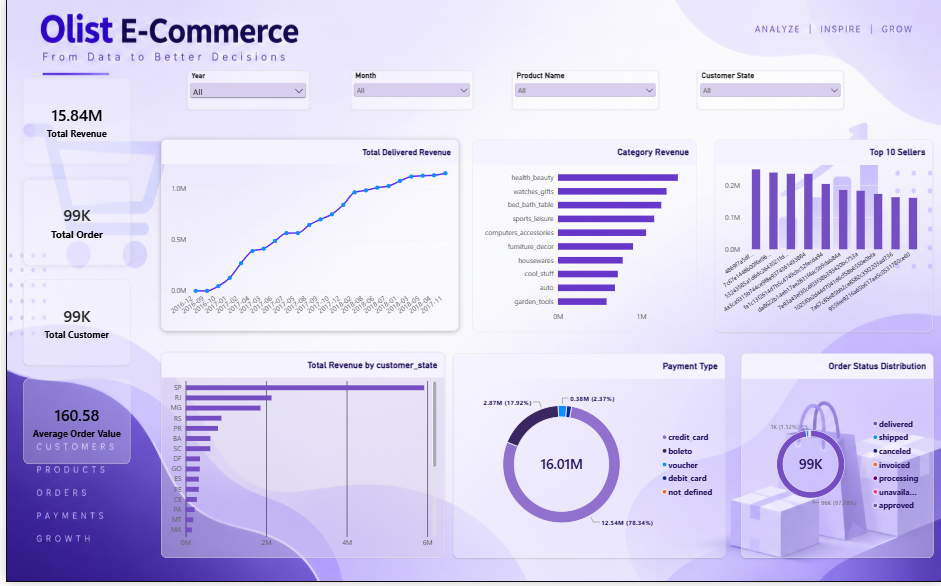

# Olist E-Commerce Sales Dashboard 📊

An interactive **Power BI dashboard** developed to analyze e-commerce sales performance using the Olist dataset.

The dashboard provides insights into revenue, orders, customers, product categories, customer states, sellers, payment methods, and order status.

## 🛠️ Tools & Technologies

- Power BI
- DAX
- Power Query
- Data Cleaning & Transformation
- Data Modeling
- Data Visualization

## 📈 Key Performance Indicators

| KPI | Value |
|---|---:|
| Total Revenue | 15.84M |
| Total Orders | 99K |
| Total Customers | 99K |
| Average Order Value | 160.58 |

## 🔍 Dashboard Features

- Revenue trend analysis by year and month
- Product category revenue analysis
- Top 10 sellers by revenue
- Revenue analysis by customer state
- Payment method analysis
- Order status distribution
- Interactive Year, Month, Product Category and Customer State filters
- Dynamic cross-filtering across visuals

## 💡 Key Business Insights

- Total revenue reached **15.84M** across approximately **99K orders**.
- **Health & Beauty** was the highest-revenue product category.
- **SP (São Paulo)** generated the highest revenue among customer states.
- **Credit Card** was the dominant payment method, contributing approximately **78.34%** of total payment value.
- Approximately **97.78% of orders were delivered**, indicating strong order fulfillment performance.
- The dashboard enables users to explore sales performance dynamically using multiple filters.

## 📷 Dashboard Preview

## 📂 Project Files

- 📊 [View / Download Power BI Dashboard](https://drive.google.com/file/d/1uQtG03n_Fif3VfQVRnRD-pIMNeylZRK_/view?usp=sharing)
- 🖼️ `Dashboard.png` — Dashboard preview
- 📄 `README.md` — Project documentation

## 🎯 Objective

The objective of this project was to transform raw e-commerce data into an interactive business intelligence dashboard and identify meaningful sales and customer insights to support data-driven decision-making.

## 👨‍💻 Author

**Ayush Kumar**

Data Analyst | Power BI | SQL | Python | Excel

---

⭐ If you found this project useful, consider giving the repository a star!
